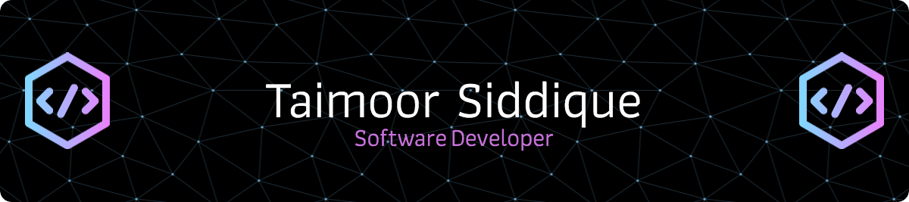

<h1 align="center">Hi 👋, I'm TAIMOOR SIDDIQUE</h1>
<h3 align="center">💻 Passionate about building innovative software solutions and exploring the latest technologies. I enjoy working on projects involving Java, Python, Machine Learning, and NLP.</h3>

  

  

- 👬I'm looking to collaborate on **"Machine Learning" and "NLP" projects.**

- 📫 You can reach me at **taimoorulhassansiddique.13@gmail.com**

- ⚡ Fun fact **When I'm not busy coding and exploring the latest technologies, I enjoy exploring the world of photography! 📸**

<h3 align="left">Connect with me:</h3>

<h3 align="left">Languages and Tools:</h3>

           

&nbsp;

